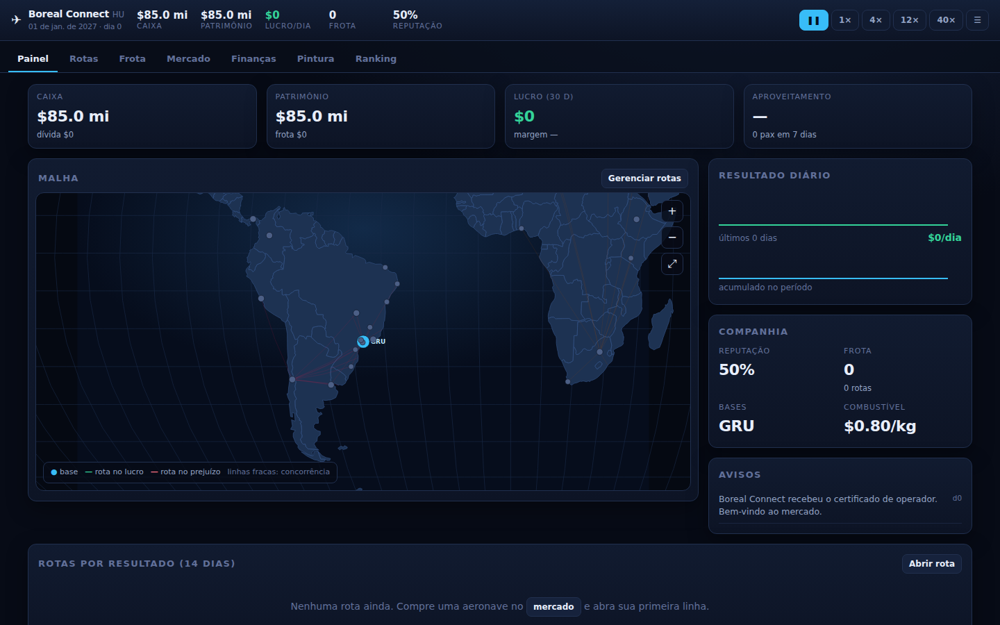
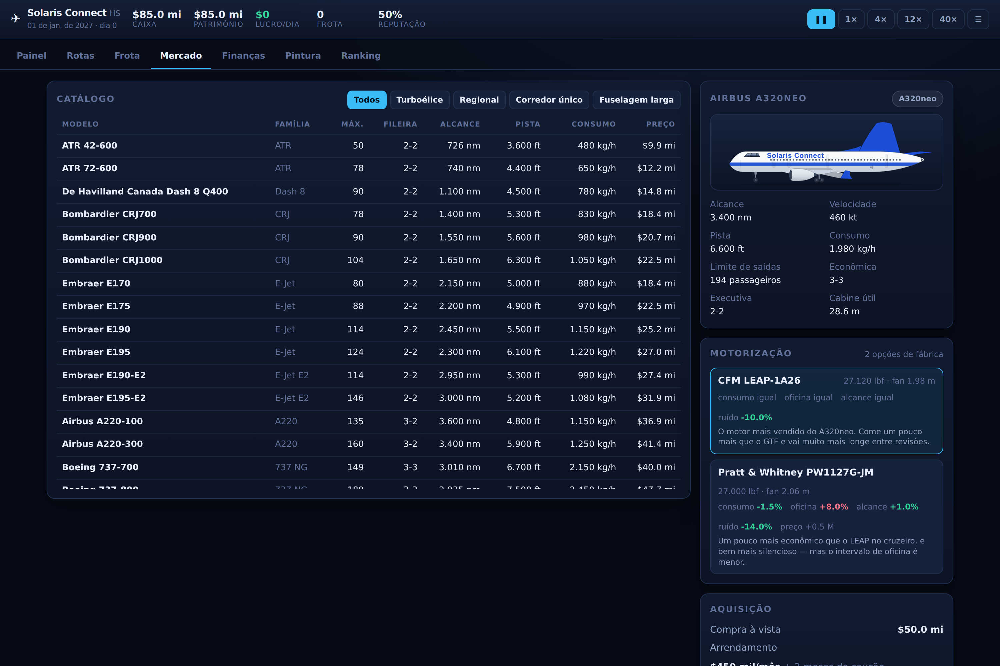
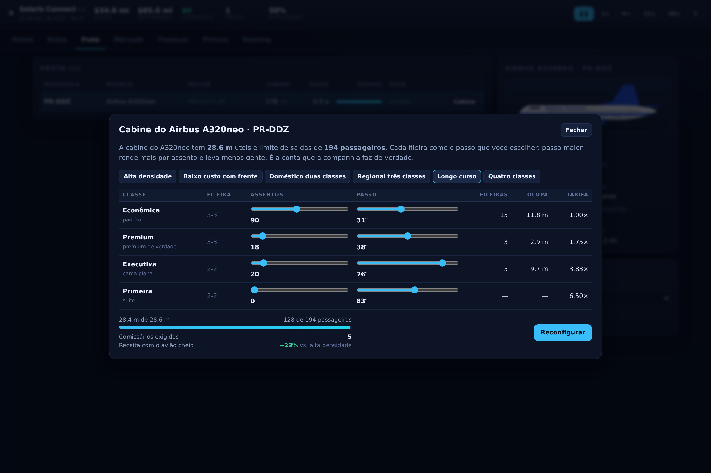

# Skyline Tycoon

Simulador de companhia aérea que roda inteiro no navegador — sem servidor, sem
conta, sem backend. Você funda a empresa, compra aeronaves, abre rotas, define
frequências e tarifas, briga por passageiro com companhias rivais e pinta a
frota do seu jeito.

Feito para publicar no GitHub Pages: `npm run build` gera uma pasta estática.







## Rodar

```bash
npm install
npm run dev      # http://localhost:5173
npm run build    # gera dist/
npm run preview  # serve o dist/
```

Requer Node 20 ou mais novo.

## Publicar no GitHub Pages

1. Suba o repositório no GitHub.
2. Em **Settings → Pages**, escolha **Source: GitHub Actions**.
3. Faça push na branch `main`.

O workflow em `.github/workflows/deploy.yml` compila e publica. O Vite está com
`base: './'`, então o mesmo build funciona em `usuario.github.io/repo/`, em
domínio próprio ou aberto direto do disco — não precisa configurar caminho.

## Como o jogo funciona

**O laço.** Comprar aeronave → abrir rota a partir de uma base → alocar o avião
→ ajustar frequência por dia da semana e tarifa por classe → ver o resultado
diário → reinvestir. O tempo corre em 1×, 4×, 12× ou 40×; barra de espaço pausa.

**Demanda.** Cada par de aeroportos tem uma demanda calculada por modelo
gravitacional: população das duas regiões, poder de compra, atratividade
turística, distância, bônus para voo doméstico, sazonalidade por hemisfério e
variação por dia da semana. Sexta e domingo enchem; terça esvazia.

**Concorrência.** Doze companhias controladas por IA operam suas próprias malhas
a partir de hubs reais. Num par disputado, a divisão de mercado sai de um modelo
logit: frequência puxa passageiro, preço alto afasta (a econômica é muito mais
sensível que a executiva), e reputação e conforto da aeronave desempatam. Elas
reagem — se você tomar mercado, cortam preço ou botam mais voo.

**Custos.** Combustível (com preço flutuante), tripulação (reforçada acima de 7 h
de voo), manutenção que encarece com a idade da célula, taxas de pouso e de
embarque por porte do aeroporto, handling, comissariado por classe e 8,5% de
distribuição sobre a receita. Aeronave velha quebra e vai para manutenção
pesada, com conta e dias de hangar.

**Restrições.** Slots por aeroporto, alcance e exigência de pista por modelo,
limite de rotações diárias por avião, crédito proporcional ao patrimônio.

**Dados.** 180 aeroportos com código IATA, nome oficial, coordenadas reais,
comprimento de pista e porte; **47 aeronaves** — variantes de verdade, não
famílias genéricas — com consumo, velocidade, dimensões, limite de saídas e
assentos por fileira reais. Os **alcances máximos** foram conferidos um a um
nas fichas dos fabricantes (airbus.com, boeing.com, embraer.com,
atr-aircraft.com, mhirj.com, dehavilland.com); onde o fabricante só publica
gráfico de carga-alcance — 737 NG, 757, 767 e 747-8 — está o valor das
Technical Characteristics arquivadas da Boeing.

## As aeronaves

O catálogo tem as variantes que existem, com a designação de fábrica: A319neo,
A320neo, A321neo, A321LR e A321XLR são cinco aviões diferentes; o 737 aparece
como −700, −800 e −900ER na geração NG e como MAX 7, 8, 9 e 10 na seguinte; o
787 vem em −8, −9 e −10; o A330 em −200, −300, −800neo e −900neo; a Embraer em
E170/175/190/195 e E190-E2/E195-E2. Cada um tem o comprimento, a envergadura, a
altura e o diâmetro de fuselagem das fichas do fabricante, e a silhueta é
desenhada a partir deles.

### Motorização

Cada modelo traz as motorizações que a fábrica realmente oferece, com a
designação completa — **CFM LEAP-1A26** ou **Pratt & Whitney PW1127G-JM** no
A320neo, **GEnx-1B74/75** ou **Trent 1000-N1** no 787-9, **Trent 900** ou
**Engine Alliance GP7270** no A380, **GE9X-105B1A** no 777-9. A escolha é feita
na compra e muda consumo, custo de oficina, alcance, pista, preço e ruído — e
até o desenho, porque o diâmetro do fan define o tamanho da nacela. As
diferenças seguem o que se sabe da operação: o GTF é mais silencioso e um
pouco mais econômico, mas passou anos com oficina cheia; o LEAP gasta um
pouquinho mais e incomoda menos. Empuxo maior compra pista curta e alcance, e
cobra em combustível e revisão.

### Cabine

A cabine é montada com a mesma aritmética de uma companhia. Cada modelo tem um
**comprimento útil de cabine** e um número de **assentos por fileira** por
classe (3-3 no A320, 3-4-3 no 777, 2-2 na executiva de corredor único, 1-2-1 na
de fuselagem larga). Você escolhe quantos assentos e **qual passo de poltrona**
em cada classe, e cada fileira come esse passo do comprimento disponível. Por
cima disso está o **limite de saídas de emergência**, que nenhuma configuração
fura.

O passo não é enfeite: uma executiva de 38″ é poltrona reclinável e cobra menos
de 2× a econômica; a mesma cabine a 76″ é cama plana e cobra quase 4×. Tirar
assento para dar espaço pode render mais — ou não, dependendo da rota. Há seis
layouts prontos (alta densidade, baixo custo com frente, doméstico duas
classes, regional três classes, longo curso e quatro classes) e o número de
comissários exigidos sai da regra real de um por 50 assentos.

## A pintura

A pintura é montada **peça por peça**, não como faixas atravessando o avião.
Cada parte tem a sua própria cor:

| Seção | O que dá para mudar |
|---|---|
| Fuselagem | cor principal, cor da barriga, altura onde a barriga começa, radome (igual ao corpo, cinza de fábrica ou cor própria) |
| Faixa | desenho (reta, larga, dupla de duas cores, onda, diagonal, degradê), cor, segunda cor, altura na fuselagem e espessura |
| Cauda | deriva, desenho da deriva (lisa, listras, curva, degradê, bipartida, chevron), cor do detalhe e estabilizador horizontal |
| Asa e motores | asa, winglet, nacela, aro do bocal e trem de pouso |
| Texto | cor do letreiro, tipografia, tamanho, posição ao longo da fuselagem, matrícula e sua cor |
| Detalhes | janelas (com cor) e contorno das portas |

Tem seis modelos prontos, um botão de sortear que gera uma combinação coerente,
e exportação em PNG. Cada ajuste aparece na hora no avião selecionado.

### Sobre as imagens das aeronaves

O desenho de cada modelo vem de uma de duas fontes:

1. **Perfil lateral livre da Wikimedia Commons**, carregado por link direto. O
   script `scripts/art.mjs` roda no `prebuild` — inclusive dentro do GitHub
   Actions — e grava as URLs em `public/aircraft/manifest.json`. O navegador
   busca a imagem em `upload.wikimedia.org`: **nenhuma imagem de terceiros é
   guardada neste repositório**, e o crédito exigido pela licença sai em
   `public/aircraft/CREDITS.md` e embaixo do avião no editor.

2. **Desenho vetorial próprio**, para o resto. A silhueta é gerada a partir das
   dimensões reais do modelo — comprimento, diâmetro de fuselagem, altura,
   envergadura, asa alta ou baixa, cauda em T, motores na asa ou na traseira,
   hélice, convés duplo, tipo de winglet.

   O desenho segue uma regra só, e é ela que resolve o contorno atravessando
   tudo: **toda peça que sai do corpo tem a raiz enterrada dentro dele**, e o
   corpo é pintado por cima. A deriva, o estabilizador e o filete dorsal nascem
   dentro do cone de cauda; a raiz da asa some na carenagem. Onde a asa
   precisa passar à frente da fuselagem — como numa foto de perfil — o
   preenchimento passa mas o traço é apagado por máscara. Sobra um contorno
   externo só, como num desenho técnico.

   A cabine de comando é montada como num avião de verdade: a linha do dorso é
   amostrada e o envidraçamento pousa nela, então o para-brisa fica colado ao
   teto em qualquer modelo. São três vidros — para-brisa muito deitado para
   trás, corrediça no meio e a janelinha traseira fechando em cunha —, com
   montantes, reflexo e limpadores. A estação e a proporção saem das medidas
   reais de cada família: no 737 o para-brisa começa a 3 m do bico e a última
   janela acaba a 6,3 m; no 747 a cabine sobe com o nariz até o convés
   superior; no A380 fica entre os dois conveses. A cabine de passageiros e a
   porta 1 só começam depois do envidraçamento.

   Para conferir de perto:

   ```bash
   npm run nose -- b737 a321neo b789 atr72     # /tmp/nose.png
   FULL=1 npm run nose -- b748 a388            # o avião inteiro
   npm run cabines                             # confere as configurações
   npm run shots                               # fotos das telas
   ```

### O que a Commons realmente tem

Varri cerca de 3.700 arquivos com verificação de licença. Perfil lateral de
avião comercial em licença livre, aproveitável como base de pintura, existe para
**dois modelos**: o ATR 72 e o A380, ambos de Olivier Cleynen em CC0. Os dois
estão fixados em `aircraft-art.json`.

O resto do que a busca encontra é foto (com a pintura de uma companhia real),
gráfico *sobre* a aeronave (alcance, pedidos, acidentes), ícone de vista
superior ou render em 3/4 — nada serve. Por isso **a varredura automática vem
desligada**. Para procurar assim mesmo:

```bash
npm run art -- --auto     # e confira o resultado antes de publicar
```

**Para cobrir mais modelos**, fixe o arquivo na mão — de qualquer acervo livre
que você escolher, não só da Commons:

```json
"b737": {
  "url": "https://upload.wikimedia.org/wikipedia/commons/…/arquivo.svg",
  "w": 1200, "h": 320,
  "author": "Nome do autor",
  "license": "CC BY-SA 4.0",
  "source": "https://commons.wikimedia.org/wiki/File:arquivo.svg"
}
```

Só entram arquivos em domínio público ou Creative Commons. Fotografia de avião
pintado não serve: carrega a marca de uma companhia real.

Se o recorte sair torto, ajuste `regions` no mesmo bloco — `box` corta cota e
legenda do desenho, `fuselage` diz onde vai a faixa, `tail` delimita a deriva e
`titles` posiciona o letreiro, tudo em fração de 0 a 1. O ATR 72 traz um exemplo
pronto.

O jogo mede a imagem no navegador (recorte pelo canal alfa) para descobrir onde
ficam fuselagem, deriva e letreiro, corrige o enquadramento e espelha o desenho
se o nariz vier apontado para o outro lado. Não precisa ajustar nada à mão — mas
dá, pelo campo `regions`.

## Estrutura

```
src/
├── game/          simulação pura, sem React
│   ├── data/      aeroportos, aeronaves, nomes
│   ├── demand.ts  modelo gravitacional de demanda
│   ├── economy.ts custos de voo e divisão de mercado
│   ├── engine.ts  estado, ações e o tick diário
│   └── ai.ts      companhias concorrentes
├── livery/        silhueta vetorial, arte da Commons e pintura
├── ui/            telas em React
└── store/         contexto do jogo
scripts/
├── art.mjs        resolve a arte livre na Wikimedia Commons
├── balance.ts     simula anos de jogo no terminal para checar o balanceamento
└── smoke.mjs      abre o jogo num navegador headless e joga sozinho
```

`npm run sim` roda a simulação de balanceamento:

```
npm run sim -- GRU 2920      # 8 anos a partir de Guarulhos
```

## Sobre nomes e marcas

As designações das aeronaves (A320, 737-800, E190…) e os códigos e nomes de
aeroportos são fatos técnicos. As companhias aéreas do jogo — a sua e as
concorrentes — são fictícias, assim como suas cores e logotipos; qualquer
semelhança com empresas reais é coincidência. Nenhum ativo do jogo veio de
produto de terceiros.

## Licença

Código sob licença MIT. As imagens carregadas da Wikimedia Commons mantêm a
licença de seus autores, listada em `public/aircraft/CREDITS.md`.

## Desenvolvimento assistido

`CLAUDE.md` registra a stack, a fronteira entre simulação e UI, os comandos e a
voz do projeto. As skills em `.claude/skills/` carregam o conhecimento de
domínio que não está óbvio no código — o porquê de cada regra, não só o passo a
passo:

| Skill | Cobre |
|---|---|
| `skyline-sim` | demanda, custos, divisão de mercado, tick diário e IA; como mexer em número sem quebrar o balanceamento |
| `skyline-fleet-data` | catálogo de aeronaves, motorizações e aeroportos; o que é ficha de fabricante e o que é número de jogo |
| `skyline-livery` | silhueta vetorial, pintura peça por peça e a arte livre da Commons |
| `meshy-assets` | geração de sprites pela API da Meshy, com scripts de geração e de padronização |
| `skyline-qa` | as três camadas de verificação antes de considerar algo pronto |
