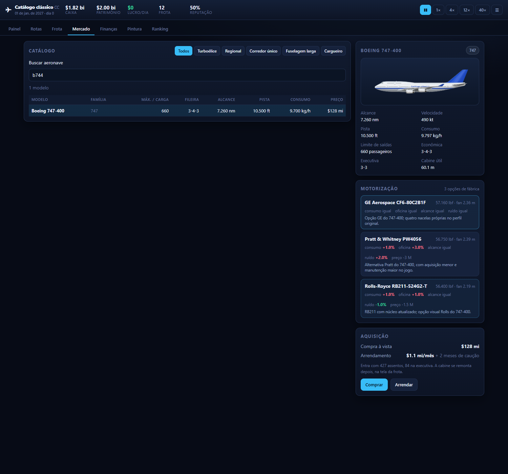

# Oficina de aeronaves 2D

A integração usa exclusivamente `Sistema Aeronaves 2D.zip`, fornecido pelo usuário. O XAPK e outras pastas de aeronaves não são fontes desta alteração. O projeto continua sendo o Skyline Tycoon em React. As 13 bases que faltavam foram cadastradas como aeronaves completas, com [fichas e fontes próprias](FONTES-AERONAVES-CLASSICAS.md), usando as regras de compra, rotas e simulação existentes.

## Usar no jogo

Em **Mercado**, use **Buscar aeronave** para localizar Q200, Q300, CRJ200, ERJ135/140/145LR, Superjet 100-95B, A318, 717-200, 737-600, A340-300/600 e 747-400. A busca aceita nome, fabricante ou ID (por exemplo, `b744`). Escolha o motor e clique em **Comprar** ou **Arrendar**. Os 13 tipos já estão disponíveis no ano inicial da partida. Na **Frota**, aloque a aeronave em uma rota compatível com seu alcance e pista; a aquisição já inclui uma cabine pronta.



1. Abra **Pintura** e escolha a aeronave e a motorização da prévia.
2. Em **Cores e peças**, pinte fuselagem, cauda, winglet e motor. Asa e estabilizador preservam os acabamentos originais do ZIP. A seleção do motor nesta tela muda a prévia; a compra no Mercado define o motor instalado.
3. Em **Camadas originais**, ative os desenhos de fuselagem e cauda. Cada camada tem sua própria cor. As combinações rápidas usam as cores da companhia e os grupos identificados nos nomes originais.
4. Em **Textos e símbolos**, configure letreiro principal, secundário, terceiro, aliança, cauda, fuselagem, motor e winglet. Posição, tamanho, rotação, fonte e cor são ajustáveis. Os símbolos são aplicados como máscaras de cor.
5. **Acervo do ZIP** permite consultar os templates, imagens em branco, logos, bandeiras, motores, imagens de classes e demais referências. São referências visuais; uma imagem de exemplo não contém uma receita de camadas editável.
6. **Baixar PNG** incorpora imagens e fontes, gerando um PNG transparente de 2400 pixels de largura. **Exportar/importar pintura** transfere a configuração entre partidas para o mesmo modelo; ao importar, as cores compartilhadas também são restauradas.
7. Em **Frota → Cabine**, escolha as 28 poltronas, o passo, a distribuição por fileira e a quantidade por classe. O mapa usa os ícones originais e mostra fileiras incompletas. A reforma só é permitida se couber na largura, no comprimento, no passo mínimo da poltrona e no limite de passageiros.
8. Use **☰ → Salvar** para guardar alterações com o jogo pausado. O salvamento automático continua ocorrendo a cada 30 dias de simulação.

As cores gerais são da companhia. Camadas, símbolos, textos e winglets são guardados por ID de modelo. Poltronas e distribuição são guardadas por aeronave. Saves anteriores, sem esses campos, continuam abrindo.

## Correspondências e limites

Veja [a relação completa dos 63 modelos integrados](INTEGRACAO-AERONAVES-2D.md). Todas as 57 bases do ZIP têm correspondência. Os cinco tipos de passageiros e 12 cargueiros sem equivalente no arquivo conservam a arte anterior; os cinco passageiros conservam também seu editor de cabine anterior. O Superjet original com SaM146 é uma entrada distinta do SJ-100 com PD-8.

As camadas originais preservam o canvas de 1200 × 450 pixels, com transparência, coordenadas e ordem de composição. A oficina não transforma os sprites em modelos 3D. Nos modelos importados, janelas, portas e parte do acabamento estão nas camadas raster do ZIP; não são redesenhados pelos controles vetoriais antigos.

Os módulos Hermes incluídos no ZIP são pseudocódigo extraído, com dependências ausentes, não um projeto React Native compilável. Sua estrutura orientou uma reimplementação para o navegador: cores por camada, opções de motores e winglets, slots de textos/símbolos, fontes e configuração de cabine. O código extraído não é executado pelo jogo. Backend, contas, loja de pacotes, direitos de alianças e serviços do aplicativo original não estão disponíveis no ZIP; não foram simulados como integrações online. Exportação/importação JSON substitui a transferência de pinturas entre contas.

Imagens e nomes das 28 poltronas vêm do arquivo. Limites de passo, custos e espaço são regras de balanceamento adaptadas ao Skyline; não representam recuperação das tabelas comerciais do jogo antigo. O mapa é esquemático e conserva o cálculo de comprimento equivalente para aviões de dois conveses.

## Arquivos e reprodução

- `public/aircraft2d/assets/`: 9.766 recursos únicos, deduplicados por SHA-256. Os bytes dos originais não foram alterados.
- `public/aircraft2d/models/`: 57 manifestos de camadas, com referências para resoluções grande e pequena.
- `public/aircraft2d/library.json`: índice pesquisável do acervo auxiliar.
- `public/aircraft2d/inventory.json`: origem, hash, caminho e tamanho dos 11.279 recursos importados.
- `src/livery/aircraft2d.ts`: correspondências e seleção de variantes.
- `src/livery/RasterAircraft.tsx`: composição e pintura.
- `src/game/seatModels.ts`: poltronas e regras de cabine, sem React.

Para refazer a extração, instale Pillow no Python utilizado e execute:

```sh
python scripts/import-aircraft2d.py "caminho/Sistema Aeronaves 2D.zip"
```

O ZIP não é necessário para rodar o jogo após a importação. Recursos auxiliares carregam sob demanda; fontes carregam quando selecionadas. O acervo importado ocupa aproximadamente 42,5 MiB.

Para conferir:

```sh
npm ci
npm run build
npm run aircraft2d:check
npm run smoke
npm run cabines
npm run sim -- GRU 1460
npm run nose -- b737 a321neo b789 atr72 crj900 a388 b748
# Em outro terminal, com npm run dev ativo:
npm run aircraft2d:ui
```

`QA_DIR` define a pasta das capturas e fixtures; o padrão é `.qa` dentro do projeto. `BROWSER_PATH` permite indicar o navegador instalado; `QA_URL` indica a URL do servidor para `aircraft2d:ui`. Os testes usam uma sessão isolada, sem o perfil pessoal do navegador. Nesta continuação, as capturas ficaram em `Downloads/Clone-work/qa-restantes`.

Validação: build; 9.766 hashes; 160 combinações de modelo, motor e opção de asa; render dos 63 modelos; PNG com fontes e nacela pintada; importação/exportação; isolamento entre modelos; save anterior e reforma persistida. Os 13 novos tipos foram comprados e arrendados com todas as 16 combinações de motores, realizando 224 voos, reforma e salvamento. A interface também compra/arrenda cada um e recarrega os 13 na Frota. Smoke sem erros de console. Simulação de 1.460 dias a partir de GRU: 10 aeronaves, 10 rotas, ocupação de 89,2% e lucro diário aproximado de US$ 1,6 milhão.
