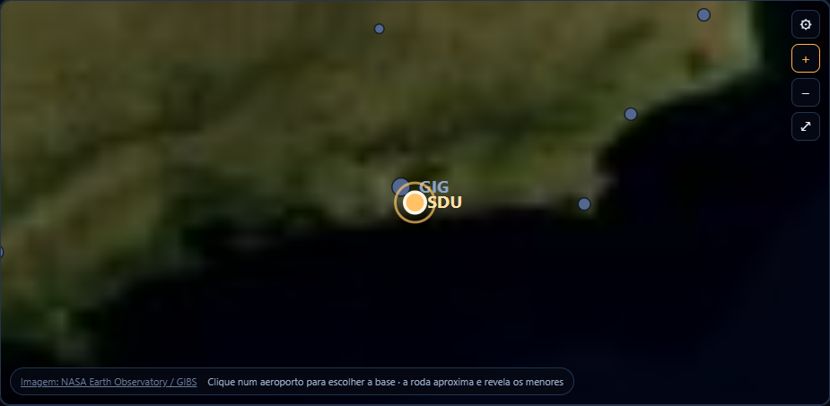
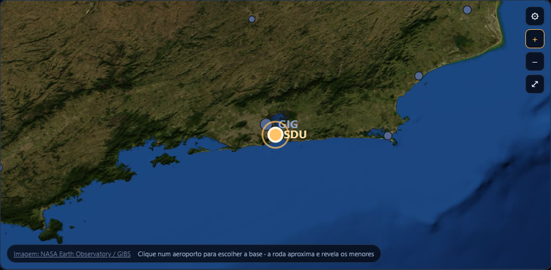

# Nitidez do mapa ao aproximar

O mapa mantém o zoom até 72× e passa a carregar detalhes por região e escala. Antes, o mesmo JPEG global era ampliado em todos os níveis. Agora o fundo local permanece disponível e os blocos NASA GIBS Blue Marble, com relevo e batimetria, entram conforme o zoom e a densidade da tela. Os botões +/− também preservam a região no centro; antes alteravam a escala mantendo a translação, deslocando o local escolhido.

## Fonte e alinhamento

- Serviço: [NASA GIBS WMTS](https://nasa-gibs.github.io/gibs-api-docs/access-basics/), camada `BlueMarble_ShadedRelief_Bathymetry`, grade geográfica `500m` em EPSG:4326/CRS84.
- Blocos de 512 px, níveis 0–7; o último corresponde a um mosaico global de 81.920 × 40.960 pixels. A seleção busca resolução suficiente para a tela até o limite da fonte, considerando densidade de até 2× para limitar tráfego no celular.
- A origem da grade é −180°/90°. Cada nível reduz pela metade a extensão de 288° do nível zero. O cálculo usa a mesma projeção equiretangular dos aeroportos e trajetos.
- O mapa é uma composição diurna estática de observações de satélite, não uma imagem ao vivo nem um mapa de ruas. A resolução nominal de aproximadamente 500 m ainda impõe um limite ao detalhe disponível.
- Referência da imagem: [NASA Blue Marble: Next Generation](https://science.nasa.gov/earth/earth-observatory/blue-marble-next-generation/base-topography-bathymetry/).

## Carregamento e celular

Só a região visível e uma margem de um bloco são solicitadas. Os gestos aguardam 120 ms sem alteração para solicitar o novo conjunto, evitando baixar cada nível intermediário. A área extra visível no SVG vertical do celular também entra no cálculo. Os limites vetoriais simplificados deixam de ser desenhados acima de 8× para não deslocar visualmente a costa detalhada.

Os detalhes exigem internet. Se o serviço falhar, o JPEG local continua visível; imagens com erro ficam transparentes, sem ícones quebrados nem bloqueio dos controles. As imagens não capturam cliques de aeroportos ou aeronaves. A atribuição NASA aparece tanto na seleção de base como no painel.

## Verificação

- `npm run map:tiles`: cobertura e alinhamento em vários níveis, densidades, linha de data, polos e tela vertical.
- `npm run map:tiles:ui`: zoom 72× centralizado, carregamento, falha real de requisição, fundo local e ausência de transbordamento em 360 e 1365 px. Usa imagens locais nas respostas simuladas para que o CI não dependa da NASA.
- `LIVE_MAP=1 npm run map:tiles:ui`: mesma verificação com o serviço real, gerando comparação antes/depois em `.qa`.
- `npm run map:geometry` e `npm run mapa`: alinhamento de trajetos, orientação dos aviões, arrasto, seleção de base, voo, painel de aeroporto e configurações de linhas.

Capturas verificadas com o serviço real, na mesma região e zoom:

| Fundo anterior ampliado | Detalhes por escala |
| --- | --- |
|  |  |

[Mapa no celular](images/mapa-zoom-mobile.png)
